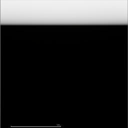

# GeneratedBand

Les tests sont utilisés sur un matériau appliqué à un widget.

## Matériau de base

## Résultat de base

## Paramètres

## Résultats
Les paramètres sont utilisés dans l'ordre suivant :
Width | Sharpness | Offset | DirectionSwitch | Compare
InputCoords n'est pas utilisé, il produit une image noire si 0,0, une image blanche sinon

### Paramètre Width
Width : Largeur de la bande générée.
### Resultats
Paramètres utilisés (Width 0.2)

### Paramètre Sharpness
Sharpness : Dureté du bord externe de la bande, utilisable seulement avec une valeur de Width.
### Résultats
#### Avec une valeur négative
Paramètres utilisés (Width 0.2, Sharpness -10)

#### Avec une valeur positive
Paramètres utilisés (Width 0.2, Sharpness 1)

### Paramètre Offset
Offset : Position de départ de la bande générée, utilisable seulement avec une valeur de Width.
### Résultats
Paramètres utilisés (Width 0.2, Offset 0.5)

### Paramètre Direction Switch
Direction Switch : Génère la bande à la verticale et non à l'horizontale, utilisable seulement avec une valeur de Width.
### Résultats
Paramètres utilisés (Width 0.2, DirectionSwitch true)

### Paramètre Compare
Compare : Sans offset, se positionne à la valeur saisie et propage la bande générée verticalement dans les deux directions. Avec l'offset, décallage dans la direction opposée à la position saisie. Utilisable seulement avec une valeur de Width.
### Résultats
#### Compare seul
Paramètres utilisés (Width 0.2, Compare 0.5, Offset 0.0)

#### Compare avec Offset
Paramètres utilisés (Width 0.2, Compare 0.5, Offset 0.2)

Paramètres utilisés (Width 0.2, Compare 0.5, Offset 0.5)

## Matériaux réalisables avec quelques combinaisons
Progress Bar : (Width 0.2, Compare 0.5)

Cadre 1 : 

Cadre 2 : (Width 0.2, Compare 0.5)

