# Widgets
## Matériaux personnalisables depuis des BP

### Matériaux Paramétrables
Utilisable dans le cas d'une barre défilante, d'un élément d'arrière plan ou d'un compteur.

Dans cet exemple simplifié, création d'un matériau dont la couleur est modifiable.
Ce matériau sera par la suite utilisé dans un widget pour faire varier sa couleur.

#### Création du Materiau
*1 materiau, 1 valeur modifiable (couleur), 1 valeur modifiable (pour savoir si on bascule sur les valeurs globales ou celles de l'instance)*

1. Création du materiau

Dans le menu, créer un nouveau "Material" et un nouveau "Material Parameters Collection"

2. Modifier le Material Parameters Collection en ajoutant les valeurs modifiables à prendre en compte

Pour la bande rectangulaire, ajout d'un vector3 pour gérer la couleur.

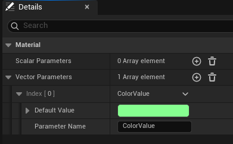

3. Edition du matériau

Modifier le *material domain*

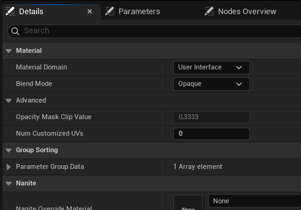

Ajouter les entrées :
- un sélecteur pour choisir si le paramètre à prendre en compte provient d'une entrée globale ou est spécifique à l'instance
- un paramètre par valeur spécifique à l'instance
- les paramètres globaux provenant du MPC

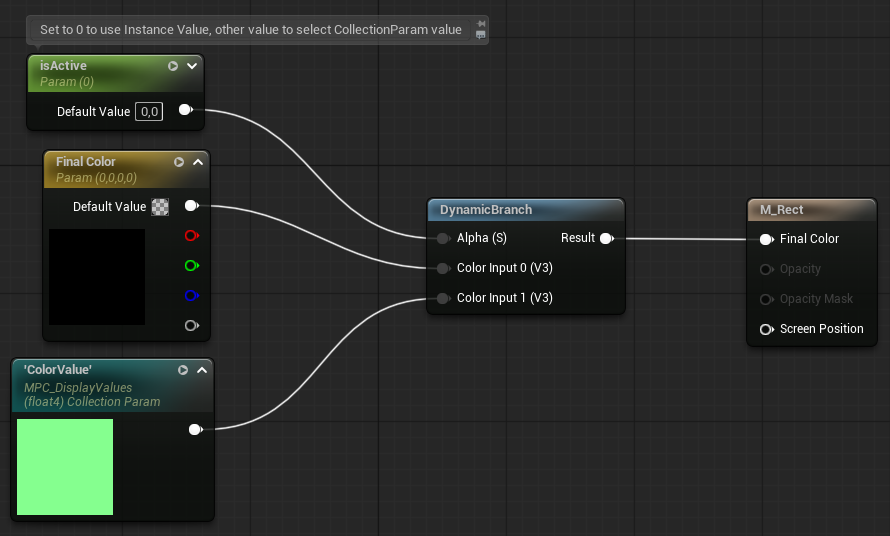

#### Utilisation du Materiau

1. Créer les instances du materiau

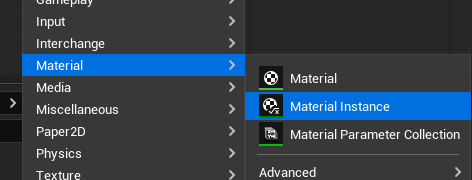

2. Créer un nouveau Widget pour le matériau

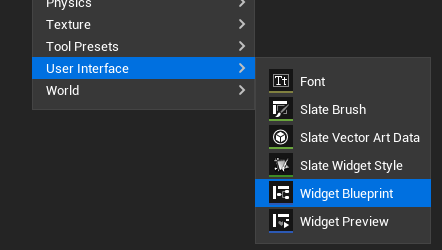

3. Ajouter une image à la pile de widgets et lui modifier la valeur appearance/brush/image avec l'instance. Mettre l'image en variable.

4. Dans l'event graph, ajouter les évènements permettant de gérer les paramètres

:warning: Set Scalar Parameter Value et Set Vector Parameter Value sont en 2 versions, la version pour les paramètres des instances et la version pour les paramètres de Collection

5. Il n'y a plus qu'à ajouter le widget au widget parent et créer son comportement

Pour l'exemple, création de 3 instances, 2 bouton pour modifier la couleur de l'instance 2 et la couleur globale, et une case à cocher pour basculer la valeur de isActive sur les 3 instances.

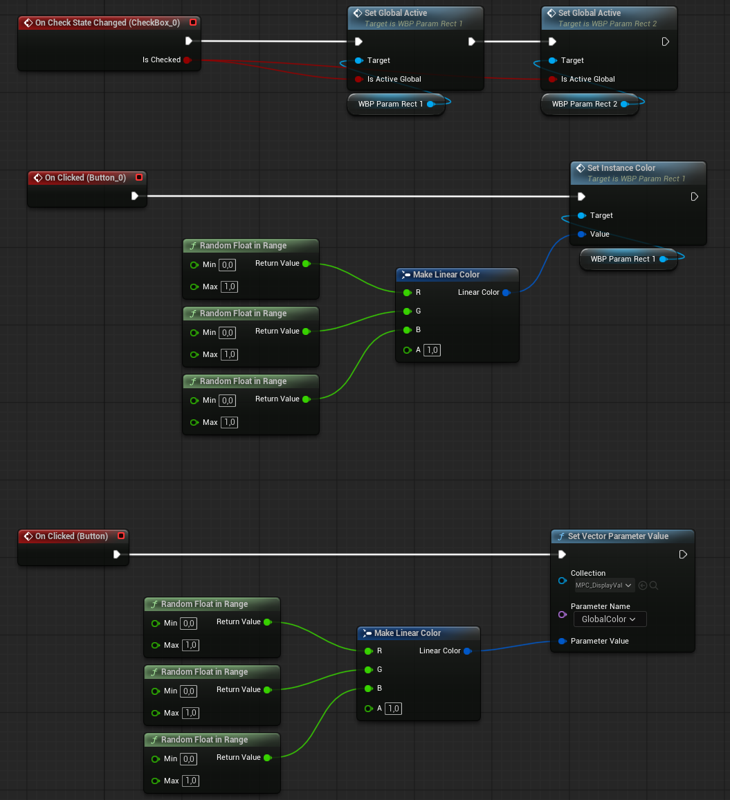

#### Résultats

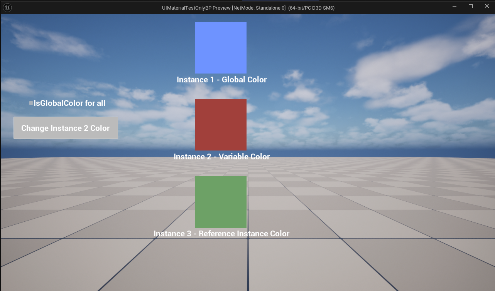

Au lancement, chaque widget a la couleur définie pour son instance.

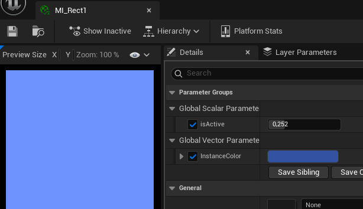
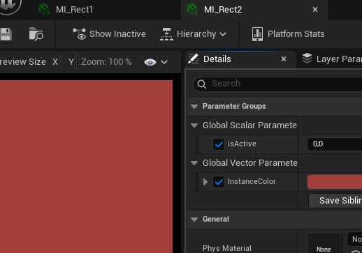

Si la case "IsGlobalColor For All" est cochée, toutes les instances prennend la valeur du paramètre défini dans la collection.
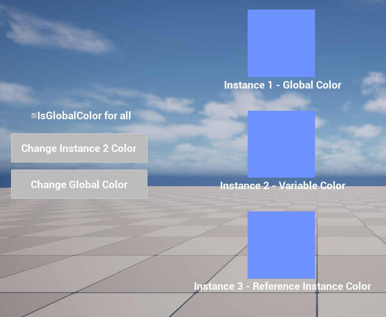

Le fait d'appuyer sur le bouton "couleur de l'instance 2" ne change les valeurs que pour l'instance 2.
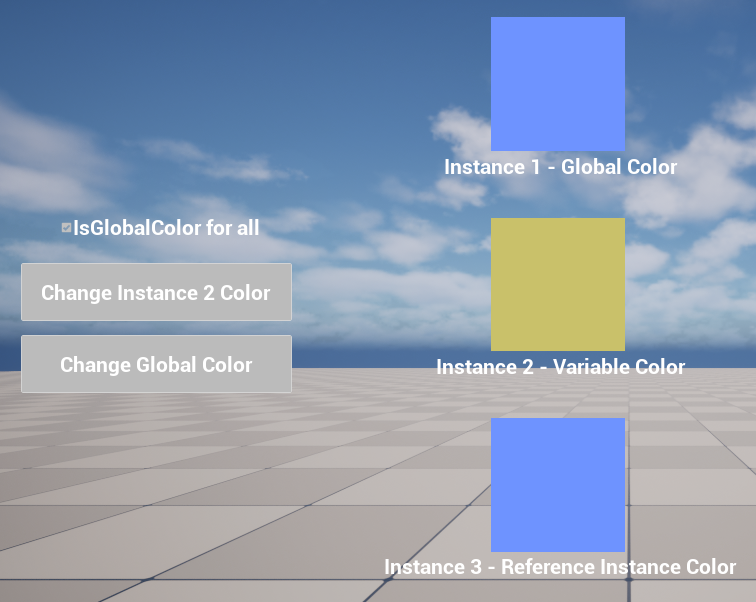

Si la case est de nouveau décochée, l'instance 2 reprend sa dernière valeur modifiée et l'instance 3 reprend la valeur d'origine de son instance.

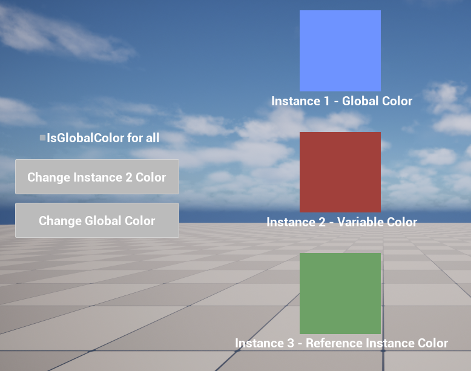

Le fait d'appuyer sur le bouton "changeGlobalColor" ne change les valeurs que pour les instances qui ont une valeur "isActive" différente de 0. Ici, la case a été cochée, la couleur de l'instance 2 a été changé, puis la couleur globale a été changée.
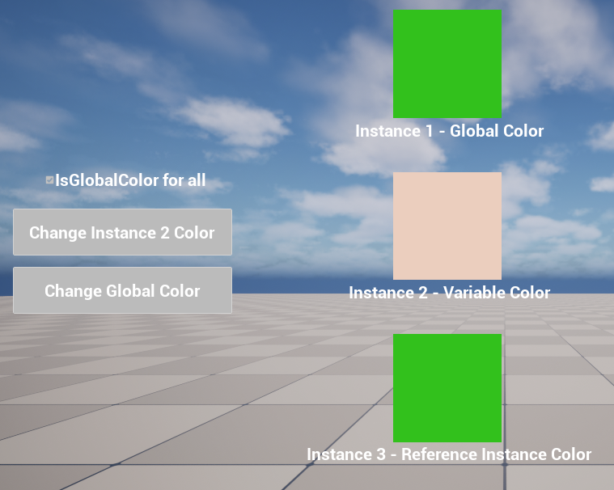

